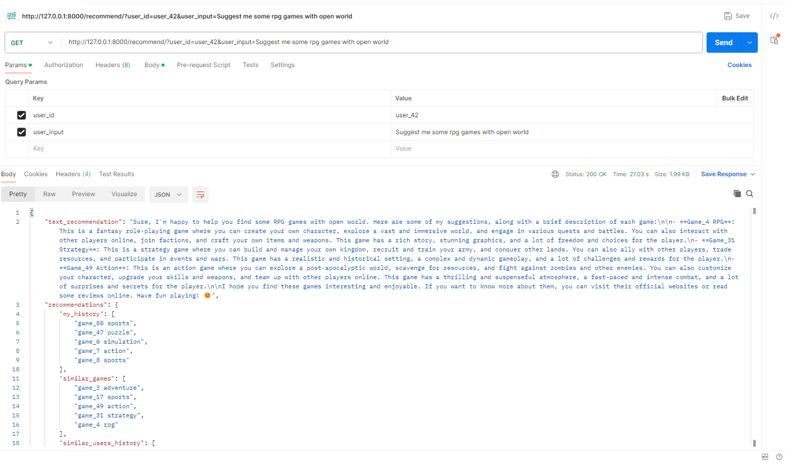

Тестовое задание MAXBITSOLUTION
===============================

Разработать рекомендательную систему для игр
--------------------------------------------
1.	После двух бесед с Михаилом Барсуковым можно сделать вывод, что компания заинтересована не просто в 
      рекомендательной системе, а в **«умном» чат-боте** с функцией рекомендации. Поэтому пойдем данным путем.
2.	В ходе [EDA](EDA.ipynb) выяснилось, что датасет имеет признаки «синтетического», а, значит, стекать 
      сложные модели, генерить фичи и, тем более, ставить костыли (из ТЗ не ясно, что именно должно 
      рекомендоваться: максимальный потенциальный рейтинг, продолжительность игры, средний чек пользователя) 
      к реальности отношения не имеет. Это абсолютно понятно для сферы гэмблинга, т.к. данные 
      пользователей – штука чувствительная. Поэтому оставим в стороне классические рекомендашки и сделаем 
      систему на основе эмбеддингов и углов между ними. Это позволит кидать в модель абсолютно 
      любые данные и она сразу будет работать.
3.	Судя по расширению файла данных **.parquet** мы тянем данные из Hadoop. А в описании позиции требовалось 
      знание Clickhouse. Из ТЗ также не ясно, откуда модель берет данные. К счастью, файл с данными 
      уже дан, поэтому не будем мудрить с дагами для Airflow и загрузим сразу файл. Разобьем данные на [имеющие 
      отношение к пользователям, играм и взаимодействию между ними](PreprocessData.py). Это не критично, но позволит 
      лучше интерпретировать происходящее.
4.	Посчитаем [эмбеддинги Bert'ом](CalculateEmbeddings.py), вычислим [метрики для рекомендательной системы](RecommendationEvaluator.py) и залогируем в mlflow.
5.	Теперь самое интересное. Будем [формировать запрос к LLM](PromptGenerator.py), кидать в нее результаты наших рекомендаций и запрос пользователя и получать текстовый ответ. По-хорошему, имеет смысл файнтьютить свою LLM, но, так как у нас нет ни корпуса, ни требований (хотя бы языка пользователя), делать это нецелесообразно. Поэтому воспользуемся [g4f в докере](https://github.com/xtekky/gpt4free) (исключительно для примера), и на данную апишку будем кидать наш запрос.
6.	Осталось понять, имеет ли запрос пользователя отношение к играм. Соберем [корпус игровых/неигровых запросов](data/raw) и обучим тот же [bert их отличать](TrainQuestionsModel.py).
7.	Соберем всё вместе и закинем в [ручку FastApi](app.py). Теперь, принимая id пользователя и его текстовый запрос, будем получать примерно такой результат:
      

Преимущества метода
-------------------
1.	Сразу может работать с любыми входными данными, вносить изменения в принцип действия не надо.
2.	«Человеческий» ответ модели (люди покупают у людей).
3.	Легкая поддержка. Посчитать/обновить эмбеддинги для любых, даже для сильно динамичных данных – не особо сложная вычислительная задача

Недостатки метода
-----------------      
1.	Перфоманс. LLM – далеко не самые быстрые модельки. Решение – можно стримить ответ модели (печатать по буковкам), т.к. подсчет самих рекомендаций происходит быстро.
2.	Необходимо обучать собственную LLM. Задача вполне решаемая, но нужен корпус вопросов/ответов. К тому же, модель нужно будет где-то крутить.
